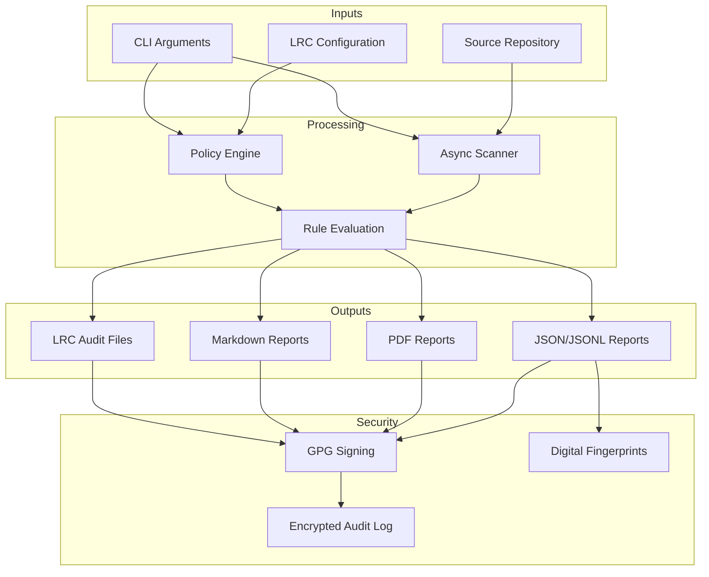

# Dev Audit Tool [DAT]

**Enterprise-Grade Source Code Auditing and Compliance Scanning**

The Dev Audit Tool (DAT) is an enterprise-focused auditing engine that performs comprehensive security, compliance, and code quality analysis of source repositories. Version **v3.0.0-alpha.1** introduces a modern modular architecture with advanced features for secure development workflows across Linux, macOS, and Windows.

## 🚀 Key Features

- **Modular Architecture** - Clean `src/dat` layout with dedicated packages for scanning, reporting, integration, and policy enforcement
- **High-Performance Scanning** - Asynchronous scanning engine optimized for large codebases with configurable safe/deep modes
- **Enterprise Integration** - Native LRC (License and Regulatory Compliance) schema ingestion for policy-as-code
- **Comprehensive Reporting** - Standardized JSONL, JSON, Markdown, and PDF outputs with cryptographic fingerprints
- **Security-First Design** - GPG artifact signing with automatic SHA256 fallbacks and encrypted audit logging
- **Developer Experience** - Rich interactive CLI with color-coded outputs, progress tracking, and intuitive flag sets

## 📊 Architecture Overview



## 🏁 Quick Start

Installation

```bash
# Clone and install with development dependencies
git clone <repository>
cd dat
pip install -e .

# Or use the automated bootstrap script
chmod +x install_deps.sh
./install_deps.sh

# Verify installation
dat --version
```

Basic Usage

```bash
# Safe scan with JSON report (recommended for development)
dat . --safe --report audit.json

# Comprehensive security audit with PDF output
dat . --deep --output audit.pdf --sign

# Enterprise scan with LRC integration
dat . --from-lrc --report audit.json --output audit.pdf --verbose
```

## 🎯 CLI Reference
```
## Core Commands

### Command Description
dat [PATH] Scan repository at PATH (default: current directory)
dat --version Display DAT version and build information
dat --help Show comprehensive help message

## Scanning Modes

### Flag Description Default
--safe, -s Enable safe scanning (skip large/binary files) true
--no-safe Disable safe scanning limitations false
--deep, -p Perform deep scan including binary analysis false
--max-lines N Maximum lines per file in safe mode 1000
--max-size N Maximum file size in bytes in safe mode 10MB

## File Management

### Flag Description
-i, --ignore PATTERN Exclude files matching glob pattern (repeatable)
--ignore-file PATH Read ignore patterns from file

## Output Formats

### Flag Description Format
-o, --output PATH Write report (auto-detects format from extension) JSON/JSONL/PDF
--report PATH Alias for --output JSON/JSONL/PDF
--jsonl PATH Write JSON Lines report JSONL
--pdf PATH Write PDF report PDF

## Enterprise Features

### Flag Description
--from-lrc [PATH] Enable LRC integration (auto-detects config)
--sign Sign artifacts with GPG
--no-sign Disable artifact signing
--interactive Enable interactive confirmation prompts

## Analysis & Comparison

### Flag Description
--diff BASELINE Compare against previous scan report
-v, --verbose Enable detailed progress output
--debug Enable debug-level logging
```
## 🔧 LRC Integration

DAT provides seamless integration with LRC (License and Regulatory Compliance) build pipelines for enterprise environments.

### Basic Configuration

Create LRC configuration:

```bash
mkdir -p ~/.config/lrc
cat > ~/.config/lrc/dat_integration.json << 'EOF'
{
  "schemas": [
    {
      "repos": ["my-project", "enterprise-.*"],
      "owner": "security-team@company.com",
      "compliance": ["soc2", "gdpr"],
      "rules": [
        {
          "id": "security.no-secrets",
          "patterns": ["API_KEY", "SECRET_", "PASSWORD="],
          "severity": "critical",
          "description": "Hardcoded credentials detected"
        }
      ]
    }
  ]
}
EOF
```

Repository Metadata

Add build context to your repository:

```json
// .lrc-build.json
{
  "project": "production-service",
  "version": "2.1.0",
  "build_id": "build-20240525-001",
  "commit_hash": "a1b2c3d4e5",
  "branch": "main",
  "compiled_at": "2024-05-25T10:30:00Z"
}
```

Enterprise Scan

```bash
# Full enterprise workflow
dat . --from-lrc --report audit.json --output compliance.pdf --sign --verbose
```

## 📊 Output Formats

JSON/JSONL Reports

· Deterministic - Consistent output for CI/CD pipelines
· Machine-readable - Structured data for automated processing
· Comprehensive - Full scan metadata, violations, and file statistics
· Fingerprinted - SHA256 hash for integrity verification

PDF Reports

· Professional - Print-ready compliance documentation
· Styled - Consistent typography with DejaVu Sans Mono/Courier fallbacks
· Comprehensive - Executive summary and detailed findings
· Brandable - Custom headers and metadata support

Markdown Reports

· Human-readable - Perfect for pull requests and code reviews
· GitHub-friendly - Renders beautifully in GitHub/GitLab
· Concise - Focused summary of critical findings

## 🔒 Security Features

Artifact Signing

```bash
# Generate signed reports
dat . --sign --report audit.json

# Verify signatures
gpg --verify audit.json.asc audit.json
```

Encrypted Audit Logging

· Automatic - Every scan is logged to ~/.config/dat/auditlog.jsonl
· Encrypted - Fernet encryption with auto-generated keys
· Tamper-evident - Cryptographic integrity protection
· Access-controlled - File permissions restrict access

Digital Fingerprints

· Repository fingerprint - Unique hash identifying the codebase state
· Report fingerprint - Integrity verification for generated artifacts
· Audit trail - Complete chain of custody for compliance

## 🛠️ Advanced Usage

CI/CD Integration

```yaml
# GitHub Actions example
- name: Security Audit
  run: |
    dat . --from-lrc --report audit.json --diff baseline.json
    if [ $? -eq 3 ]; then
      echo "New violations detected - failing build"
      exit 1
    fi
```

Performance Optimization

```bash
# For very large repositories
dat . --deep --max-size 52428800 --max-lines 5000 --batch-size 1000

# Focus on specific file types
dat . --include "*.py" --include "*.js" --include "*.yaml"

# Exclude generated assets
dat . --ignore "node_modules/" --ignore "dist/" --ignore "*.min.*"
```

Custom Rule Development

```json
{
  "rules": [
    {
      "id": "custom.license-header",
      "patterns": ["Copyright 2024", "MIT License"],
      "severity": "info",
      "description": "License header check",
      "category": "compliance"
    }
  ]
}
```

## 🐛 Troubleshooting

### Common Issues

Binary Detection Problems

```bash
# Install libmagic for improved file type detection
sudo apt-get install libmagic1  # Ubuntu/Debian
brew install libmagic           # macOS

# Use fallback mode
dat . --no-magic
```

GPG Signing Failures

```bash
# Check GPG installation and configuration
gpg --list-secret-keys
export DAT_SIGNING_KEY=YOUR_KEY_ID

# Disable signing if not required
dat . --no-sign --report audit.json
```

Performance Issues

```bash
# Reduce parallelism for resource-constrained environments
dat . --parallel-scans 2 --batch-size 500

# Limit memory usage
dat . --max-memory 2048
```

Debug Mode

```bash
# Enable detailed debugging
DAT_DEBUG=1 dat . --verbose --debug

# Profile performance
dat . --profile --report profile.json
```

## 📚 Documentation

Comprehensive documentation is available in the docs/ directory:

· Usage Guide - Complete CLI reference and examples
· LRC Integration - Enterprise policy management
· Output Formats - Report specifications and examples
· GPG Signing - Cryptographic signing guide
· CI/CD Integration - Pipeline examples and best practices
· Rule Development - Custom rule creation guide

## 🧪 Development

Testing

```bash
# Run test suite
pytest

# With coverage reporting
pytest --cov=dat --cov-report=html

# Run specific test categories
pytest tests/test_scanner.py -v
pytest tests/test_integration.py -v
```

Code Quality

```bash
# Type checking
mypy src/dat

# Code formatting
black src/dat tests

# Import sorting
isort src/dat tests

# Linting
flake8 src/dat tests
pylint src/dat
```

Building and Distribution

```bash
# Build package
python -m build

# Run tox matrix
tox

# Create development environment
python -m venv venv
source venv/bin/activate  # Linux/macOS
venv\Scripts\activate     # Windows
```

## 🤝 Contributing

We welcome contributions! Please see our Contributing Guide for details on:

· Code style and standards
· Testing requirements
· Pull request process
· Issue reporting

## 📄 Licensing

DAT is distributed under the MIT License. See [LICENSE](./LICENSE) for complete details.

## 🆘 Support

· Documentation: Full documentation available in docs/ directory
· Issues: Report bugs and feature requests via GitHub Issues
· Discussions: Join community discussions for help and ideas

---
