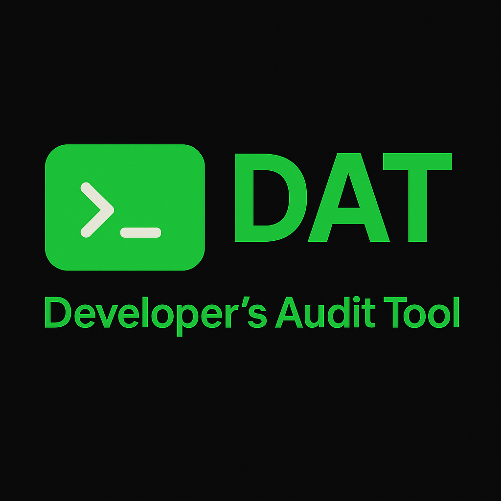
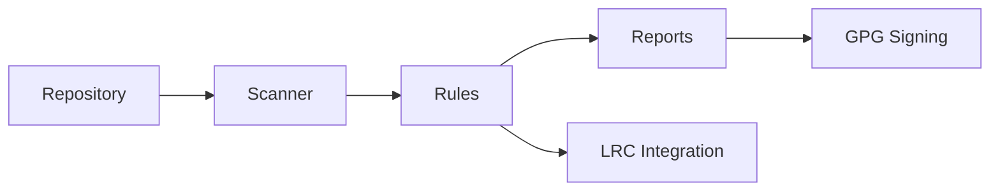

# Dev Audit Tool (DAT) v3.0.0-alpha.1



The Dev Audit Tool (DAT) is an enterprise-focused auditing engine that inspects source repositories,
applies policy rules, and emits portable reports. Version **v3.0.0-alpha.1** introduces a modular
`src/dat` layout, LRC schema ingestion, and signed JSON/Markdown/PDF outputs designed for secure
workflows on Linux, macOS, and Windows.



## Quickstart

```bash
# Clone and install in editable mode
pip install -e .[dev]

# Or bootstrap system dependencies
chmod +x install_deps.sh
./install_deps.sh
```

Once installed, invoke the CLI from any repository root:

```bash
# Safe scan with JSON output
dat . --safe --report audit.json

# Deep scan with PDF and signing
dat . --deep --output audit.pdf --sign

# Enrich results using .lrc-build.json
dat . --from-lrc --report audit.json --output audit.pdf
```

## CLI Overview

| Flag | Description |
| ---- | ----------- |
| `PATH` | Repository root to audit (defaults to `.`). |
| `--from-lrc` | Consume `.lrc-build.json` metadata and emit `.lrc-audit.json`. |
| `-i/--ignore` | Provide glob patterns to exclude (repeatable). |
| `--max-lines` | Maximum lines per file when `--safe` (default: 1000). |
| `--max-size` | Maximum file size in bytes when `--safe` (default: 10 MiB). |
| `--safe` / `--no-safe` | Toggle safe scanning mode (safe by default). |
| `--deep` | Perform an aggressive scan without safe limits. |
| `--report` | Write a JSON (`.json`) or Markdown (`.md`) report. |
| `-o/--output` | Write a PDF report. |
| `--sign` | Sign generated reports with GPG (creates `.asc` files). |
| `--diff` | Compare the current scan against a previous JSON report. |
| `-v/--verbose` | Emit progress information. |
| `--version` | Display DAT version and exit. |

Safe mode skips binary files, large artefacts, and long files to keep runs fast. Combine `--deep`
with `--no-safe` for exhaustive inspections.

## LRC Integration

When `--from-lrc` is supplied, DAT merges shared defaults from
`~/.config/lrc/dat_integration.json` with the repository-local `.lrc-build.json`. The resulting
metadata is injected into report headers and stored in `.lrc-audit.json` alongside scan statistics,
policy findings, and signing fingerprints when available.

Minimal `.lrc-build.json` example:

```json
{
  "project": "sample",
  "version": "1.2.3",
  "compiled_at": "2024-05-25T10:30:00Z"
}
```

## Output Formats

* **JSON** – Deterministic, UTF-8 encoded payload suitable for ingestion or CI systems.
* **Markdown** – Readable summary for pull requests or manual reviews.
* **PDF** – Generated with ReportLab using DejaVu Sans Mono (Courier fallback) for consistent
  rendering across platforms.

All report writers use atomic file replacement to avoid partial artefacts. When `--sign` is enabled,
DAT attempts to run `gpg --detach-sign` for each artefact and places the ASCII-armoured signature
next to the original file.

## Troubleshooting

* Install the optional `python-magic` wheel on Windows to improve binary detection.
* Use `--deep` for repos dominated by generated assets or minified bundles.
* Set `DAT_FORCE_COLOR=1` to keep colour output when piping results.

## Documentation

Additional guides live in the `docs/` directory:

* [Usage](docs/usage.md)
* [LRC Integration](docs/integration-lrc.md)
* [Output Formats](docs/output-formats.md)
* [GPG Signing](docs/gpg-signing.md)
* [CI/CD](docs/ci.md)

## License

DAT is distributed under the MIT License. See [LICENSE](LICENSE) for details.
